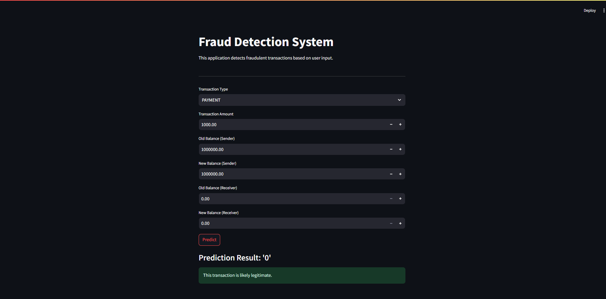

# 🛡️ Fraud Detection Using Machine Learning

<p align="center">
  
</p>

---

##  Problem Statement

Financial fraud is a serious problem that affects millions of people and businesses worldwide. As more transactions happen online—whether it’s paying for goods, transferring money, or using credit cards—there’s a greater risk of criminals trying to steal money or sensitive information. Detecting these fraudulent activities quickly is crucial to prevent losses and protect everyone involved.

The goal of this project is to create a computer program using machine learning, a type of artificial intelligence. I trained the program on historical transaction data so it can learn patterns that indicate fraud. Once trained, it can predict in real-time whether a new transaction might be fraudulent. This helps banks and companies act fast and stop fraud before it happenswith an accuracy of 95%.

---

## 🌐 Streamlit App Preview

To make it easy for users to interact with the fraud detection program, I built a simple web application using Streamlit. This app provides a user-friendly interface where anyone can enter transaction details and instantly get a prediction on whether the transaction is likely safe or fraudulent.

Below is a screenshot of what the app looks like:



---

## 📊 Dataset

The data I used to train and test the fraud detection program comes from a well-known source on Kaggle, a platform for data science projects. This dataset contains records of over 280,000 financial transactions made by European credit card users in September 2024. Among these, was a fraction of transactions that were fraudulent.

Each transaction is described by 30 pieces of information (called features), such as the time it happened, the amount spent, and other anonymized values that represent underlying patterns without revealing sensitive details. The goal is to use this data to teach the model how to spot the small number of fraud cases among all transactions.

---

## ⚙️ Project Workflow

### 1. Data Preprocessing

First, I loaded the dataset and examined it to understand what information it contained and if there were any missing or incorrect values. I also looked at how different features relate to each other, removing those that were too similar or unnecessary to improve model performance.

### 2. Feature Engineering

Next, I prepared the data for the machine learning model by scaling important features like transaction amount, so the model treats all features fairly. I also separated the input data (features) from the output data (whether a transaction is fraud or not).

### 3. Handling Class Imbalance

Since fraudulent transactions are very rare compared to normal ones, the dataset is imbalanced. To address this, I used a technique that balances the data by reducing the number of normal transactions so that the model doesn’t become biased towards only recognizing normal transactions.

### 4. Model Building

I trained a Logistic Regression model, a common and effective method for classification tasks. After training, I tested how well the model performs by measuring accuracy and other metrics that indicate how often it correctly predicts fraud and non-fraud cases. I saved this trained model so it can be used later in the app.

### 5. Deployment

Finally, I built the Streamlit web app that loads the trained model and allows users to enter transaction details. The app processes the input and quickly predicts if the transaction is fraudulent, making it easy to use without needing any programming skills.

---
In this project, I used Logistic Regression as the primary algorithm to detect fraudulent transactions. Logistic Regression is a simple yet powerful classification technique that estimates the probability of a binary outcome—in this case, whether a transaction is fraudulent (1) or not (0). It is particularly effective for problems involving clear patterns in the data. I enhanced the model’s performance by applying preprocessing steps such as feature scaling and categorical encoding, all organized within a pipeline to ensure a clean and efficient workflow. The model achieved an impressive accuracy of 95%, demonstrating that Logistic Regression, when combined with proper data preparation and class balancing techniques, is highly effective in identifying fraudulent activities with precision and reliability.

## 🛠️ How to Use

Follow the steps below to run the fraud detection system on your local machine:

```bash
# 1. Clone the repository
git clone https://github.com/yourusername/fraud-detection-streamlit.git
cd fraud-detection-streamlit

# 2. Install all required Python packages
pip install -r requirements.txt

# 3. Launch the Streamlit web application
streamlit run app.py

